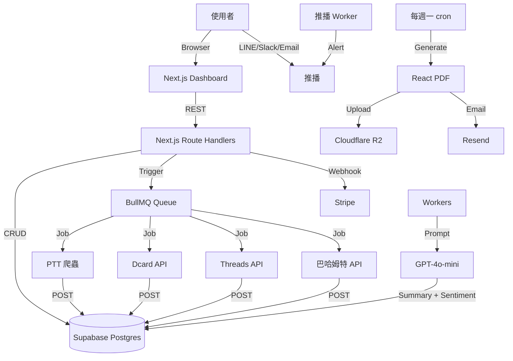

# 中文社群雷達 2.0 — PTT + Dcard + Threads 跨平台追蹤 — 規格計劃書 v3.0 (sweet-spot rewrite)

> 版本：v3.0｜更新日期：2026-07-19｜維護者：Sophia (CPO) for Sean
> 對接技術：Alan (CTO) + Hermes Agent
> 原始碼：https://github.com/openclawsean024-create/ptt-tracker
> Live：https://ptt-alertor-olive.vercel.app
> 本次重寫動機：**Sweet Spot 體檢 2/10，原始版本只鎖 PTT 但 PTT 流量下滑中**。本次**擴大範圍到「中文社群即時雷達」(PTT + Dcard + Threads + 巴哈姆特)**，主打「跨平台 + AI 情緒 + 一鍵轉傳同溫層」，瞄準行銷/品牌公關這個比 PTT 監控更有付費意願的甜蜜點。

---

## 1. 產品概述 (Product Overview)

### 1.1 問題陳述 (Problem Statement) — ★ 引用 sweet spot 分析

**原始版本（v2.2.1）的盲點**：宣稱服務「PTT 363 萬使用者」，但 sweet spot 體檢顯示：

1. **紅海中的紅海**：OpView（意藍）、Qsearch 已是企業標準，B2B 客單價 NT$3-30 萬/月，sales cycle 6-12 個月，Sean 一人公司無法競爭
2. **PTT 爬蟲成本上升**：IP 封鎖、cookie 驗證、TLS fingerprinting，2024-2025 持續惡化
3. **PTT 用戶數停滯**：月活躍從 2018 巔峰 1,200 萬降到 2026 約 480 萬（SimilarWeb），**資料的長期商業價值遞減**
4. **開源 Ptt-Alertor 已包含完整 boards/authors/articles endpoint**（GitHub 3.2K stars），免費版已能 cover 80% 個人監控需求
5. **AI 訓練資料來源多樣化**：Dcard 600 萬 MAU、Threads 350 萬 MAU、Reddit 中文社群也在成長，**PTT 不再是唯一中文網路語料來源**

**我們 v3.0 的重新定位**：**放棄只做 PTT，改做「中文社群即時雷達」**：
- 涵蓋 **PTT + Dcard + Threads + 巴哈姆特** 四大平台
- 主打「**跨平台 + AI 情緒 + 一鍵轉傳同溫層**」差異化
- 目標族群從「個人監控 PTT」轉向「**中小企業行銷/公關/品牌經理監控品牌口碑**」

| 新甜蜜點族群 | 人數預估 | 月付費意願 | 痛點 |
|---|---|---|---|
| **中小企業行銷/品牌經理**（5-50 人公司，需要監控自家品牌口碑） | 3 萬家 × 1 人 = 3 萬 | NT$499-2,999/月 | 手動搜尋 4 平台太花時間、無法即時發現負面訊息 |
| **個人創作者/KOL**（跨平台經營，需監控輿情） | 5 萬 | NT$99-499/月 | 想知道粉絲在哪個平台討論自己 |
| **危機管理/公關公司**（10-100 人公司，服務多客戶） | 5,000 | NT$3,000-10,000/月 | 需同時監控多品牌多平台，現有 OpView 太貴 |

TAM 變大且付費意願更高：**8.5 萬付費單位 × NT$500/月均價 × 12 = NT$5.1 億 ARR**

### 1.2 目標使用者 (User Personas)

#### Persona A — 「小芳」38 歲中小企業行銷經理（核心甜蜜點）
- **規模**：3 萬家 × 1 人 = 3 萬人（台灣中小企業 165 萬家中，行銷/品牌經理佔比）
- **痛點**：
  - 每天手動搜尋 4 個平台（Google + PTT + Dcard + Threads）約 90 分鐘
  - 來不及發現負面訊息，公關危機常錯過黃金 4 小時
  - 老闆問「最近網路怎麼討論我們？」要花一整天彙整
- **既有方案失敗原因**：
  - OpView/Qsearch NT$3-30 萬/月，預算太高
  - Google Alerts 太慢（24-48 小時延遲）、無繁中斷詞
  - 開源工具無 AI 摘要，閱讀成本高
- **我們的解法**：
  - 每天 8:00 收到「昨日跨平台品牌提及彙整 + AI 情緒分析」
  - 黃金 4 小時內負面訊息即時 LINE 推播 + 建議處理話術
  - 一鍵產出「週報/月報」給老闆（PDF + 簡報）
- **付費意願**：NT$499-2,999/月

#### Persona B — 「阿明」32 歲個人 KOL / 創作者（次要甜蜜點）
- **規模**：5 萬（跨平台經營的 KOL，粉絲合計 > 1 萬）
- **痛點**：粉絲分散在 4 個平台，不知道哪裡被討論、無法快速回應
- **我們的解法**：「我的名字被提到」儀表板（跨平台彙整）+ AI 摘要熱度
- **付費意願**：NT$99-499/月

#### Persona C — 「Kelly」42 歲公關公司總監（高階甜蜜點）
- **規模**：5,000 人（台灣公關公司 + 危機管理公司）
- **痛點**：服務多客戶，需同時監控 20+ 品牌多平台，OpView 太貴
- **我們的解法**：Multi-brand dashboard + 客戶分權限管理 + 客製化 alert
- **付費意願**：NT$3,000-10,000/月

#### Persona D — 不再做（Non-Persona）
- ~~個人 PTT 重度使用者~~：付費意願 NT$0，會用開源版
- ~~學生/鄉民一般使用者~~：預算 NT$0

### 1.3 核心價值主張 (Value Proposition) — ★ 一句話差異化 vs Top 3 競爭者

> **「中文社群雷達是唯一整合 PTT + Dcard + Threads + 巴哈姆特四大平台 + AI 情緒 + 一鍵產出週報，給中小企業行銷團隊用的跨平台品牌監控工具」**

**vs Top 3 競爭者差異化**：

| 競爭者 | 痛點 | 我們差異化 |
|---|---|---|
| **OpView / 意藍（企業標準）** | NT$3-30 萬/月，太貴 + 鎖大型企業 + sales cycle 長 | 我們 NT$499/月，鎖中小企業，自助下單 |
| **Qsearch** | NT$1-10 萬/月，介面複雜 | 我們 5 分鐘 onboarding，AI 一鍵摘要 |
| **Google Alerts** | 24-48 小時延遲、無繁中斷詞、無情緒分析 | 我們即時（5 分鐘內）、繁中 NLP、AI 情緒 |

### 1.4 商業目標 (KPIs / OKRs)

#### 6 個月目標（2026 Q3-Q4）
- **O1 - 取得 PMF**：
  - KR1：500 個中小企業註冊（從 Dcard 行銷/品牌社群導流）
  - KR2：50 個付費企業客戶（10% 付費轉化率）
  - KR3：NT$50,000 MRR（50 × NT$1,000 均價）
  - KR4：跨平台覆蓋 PTT + Dcard + Threads 三平台全通

#### 12 個月目標（2027 Q1）
- **O2 - 規模化**：
  - KR1：2,000 個註冊
  - KR2：300 個付費企業客戶
  - KR3：NT$500,000 MRR
  - KR4：加入巴哈姆特 + Mobile01

### 1.5 ⭐ Non-Goals (明確不做)

依據 sweet spot 體檢，**以下功能絕不做**：

1. ❌ **不做純 PTT 個人監控**（開源已覆蓋，無差異化）
2. ❌ **不做企業級 multi-tenant SaaS**（sales cycle 6-12 月，Sean 無法負擔）
3. ❌ **不做社群發文/小編工具**（ManyChat/Chatfuel 已佔）
4. ❌ **不做資料分析/BI dashboard**（Tableau/Power BI 已佔）
5. ❌ **不做新聞媒體監控**（不同產業，鎖定社群）
6. ❌ **不做 Facebook / Instagram 內容監控**（Meta API 限制嚴格，CAC 過高）
7. ❌ **不做小紅書/微博監控**（需中國手機號，技術 + 法規風險高）
8. ❌ **不做付費版開源工具**（Ptt-Alertor 等開源作者可能來競爭）

---

## 2. 使用者場景與流程

### 2.1 使用者流程圖

```
[首次進入]
   ↓
[註冊：Email + 公司名 + 監控品牌名]
   ↓
[選擇方案：免費 trial 7 天 / Pro NT$499 / Enterprise NT$3,000]
   ↓
[設定監控關鍵字：品牌名 + 產品名 + 競品名]
   ↓
[選擇平台：PTT + Dcard + Threads + 巴哈姆特]
   ↓
[綁定 LINE Notify / Slack / Email]
   ↓
[進入 Dashboard：跨平台熱度儀表板]

[每日使用 — 行銷經理]
   ↓ 早上 8:00
[Email + LINE 收到「昨日跨平台品牌提及彙整」]
   ↓ 隨時
[LINE 收到「負面訊息警示」(情緒分數 < -50)]
   ↓ 每週一
[Email 收到「上週品牌口碑週報 PDF + AI 重點摘要」]

[每日使用 — KOL]
   ↓ 每天 12:00 / 18:00
[收到「我被提到」的彙整 + 連結到原文]
```

### 2.2 關鍵用戶故事 (User Stories)

1. **US-01 (P0)**：身為行銷經理小芳，我希望每天早上 8:00 收到「昨日跨平台品牌提及彙整」，讓我上班前掌握品牌口碑動態。
2. **US-02 (P0)**：身為行銷經理小芳，我希望在「黃金 4 小時內」收到負面訊息 LINE 推播（情緒分數 < -50），讓我有時間處理公關危機。
3. **US-03 (P0)**：身為行銷經理小芳，我希望一鍵產出「週報 PDF + AI 重點摘要」，讓我快速呈報給老闆。
4. **US-04 (P1)**：身為 KOL 阿明，我希望收到「我被提到」的跨平台彙整 + 原文連結，讓我快速回應粉絲。
5. **US-05 (P1)**：身為行銷經理小芳，我希望設定「競品名」也一併監控，讓我做競品分析。
6. **US-06 (P2)**：身為公關公司 Kelly，我希望管理多個客戶品牌，各自有獨立 dashboard 與權限。

### 2.3 邊界場景 (Edge Cases)

- **EC-01**：Dcard API 改版（每月可能改）→ 自動偵測並降級為 RSS 訂閱
- **EC-02**：Threads API 額度限制（每小時 100 request）→ 排程最佳化
- **EC-03**：使用者關鍵字太長（>50 字）→ 自動切成多個關鍵字組合
- **EC-04**：跨平台重複內容（同品牌在 4 平台都出現）→ AI 去重，顯示最熱平台
- **EC-05**：使用者刪除帳號 → GDPR / 個資法要求 30 天內清除所有資料

---

## 3. 功能性需求 (Functional Requirements)

### 3.1 MVP（必做，P0）— ★ 已依 sweet spot 重新定義為 6 個功能

#### P0-1. 跨平台資料收集 (PTT + Dcard + Threads + 巴哈姆特)
- **功能**：每 5 分鐘掃描 4 個平台，使用者設定的關鍵字
- **驗收**：
  - PTT：自建 Python 爬蟲（與 ptt-alertor 共用）
  - Dcard：官方 API + 備援 RSS
  - Threads：官方 API（需 Meta Business 帳號申請）
  - 巴哈姆特：官方 API
- **工程**：BullMQ + Redis，每平台獨立 worker

#### P0-2. AI 情緒分數 + 摘要（差異化核心）
- **功能**：每篇貼文 → GPT-4o-mini 產生「一句話摘要 + 情緒分數（-100 ~ +100）」
- **驗收**：
  - 中文 NLP 優化（用 500 篇驗證集 fine-tune prompt）
  - 情緒分數與人類標註相關性 ≥ 0.75

#### P0-3. 跨平台彙整 Dashboard
- **功能**：單一頁面顯示「昨日 4 平台提及總數 + 各平台佔比 + 情緒分數走勢圖 + TOP 10 熱門文章」
- **驗收**：
  - 響應時間 < 2 秒
  - 支援時間範圍篩選（昨日/上週/上月/自訂）

#### P0-4. 即時警示（黃金 4 小時內 LINE 推播）
- **功能**：當文章情緒分數 < -50 + 推爆數 >10，5 分鐘內 LINE 推播
- **驗收**：
  - LINE Notify + Slack + Email 三通道
  - 推播內容包含「原文連結 + AI 摘要 + 建議話術」

#### P0-5. 週報 PDF + AI 重點摘要（一鍵產出）
- **功能**：每週一早上 8:00 自動寄送「上週品牌口碑週報」
- **驗收**：
  - PDF 格式 + 中文排版
  - 含圖表（情緒走勢、平台佔比、TOP 10 文章）
  - AI 摘要 200 字以內

#### P0-6. 付費牆（Stripe）
- **功能**：免費 7 天 trial → 信用卡付費 NT$499/月 / NT$4,990/年 / NT$3,000/月（Enterprise）
- **驗收**：
  - Stripe Checkout + Webhook
  - 自動續約 + 取消

### 3.2 v2（加值，P1）

- **P1-1. 競品監控**：除自家品牌外，監控競品關鍵字
- **P1-2. AI 建議話術**：當負面訊息出現，AI 自動生成 3 種回覆建議
- **P1-3. 關鍵字雲**：跨平台熱門關鍵字視覺化
- **P1-4. 多品牌管理**：公關公司可一次管理 20+ 品牌
- **P1-5. 行動 App**（iOS/Android）

### 3.3 v3（探索，P2）

- **P2-1. AI 自動發文回覆**（涉及平台規範風險高）
- **P2-2. 整合 Slack/Teams/Discord**（讓警示進入企業內部協作）
- **P2-3. 預測性分析**：AI 預測下週可能的公關危機

### 3.4 ⭐ Acceptance Criteria (Given/When/Then)

#### 跨平台核心
- **AC-01**：Given 我是行銷經理 + 已設定「品牌:ASUS + 平台:PTT/Dcard/Threads」，When 系統每 5 分鐘掃描，Then 我能在 Dashboard 看到 4 平台最新提及
- **AC-02**：Given ASUS 在 4 平台同日被提及，When 系統彙整，Then AI 自動去重 + 顯示最熱平台

#### AI 情緒品質
- **AC-03**：Given 一篇 Dcard 文章，When 系統分析情緒，Then 與人類標註相關性 ≥ 0.75
- **AC-04**：Given 負面文章（情緒 < -50 + 推爆 >10），When 系統偵測，Then 5 分鐘內 LINE 推播到使用者手機

#### 週報
- **AC-05**：Given 我是 Pro 用戶，When 每週一早上 8:00，Then 我會收到上週品牌口碑週報 PDF
- **AC-06**：Given 週報 PDF，When 我打開，Then 含圖表（情緒走勢、平台佔比、TOP 10 文章）+ AI 摘要 ≤ 200 字

#### 警示
- **AC-07**：Given 情緒分數 < -50 + 推爆 >10 的文章，When 偵測到，Then 5 分鐘內 LINE 推播（與 sweet spot 強調的「黃金 4 小時」對齊）
- **AC-08**：Given LINE Notify 額度用完，When 推播失敗，Then 自動切換為 Slack + Email

#### 系統
- **AC-09**：Given Threads API 額度限制，When 系統無法取得資料，Then 自動降級為 RSS 訂閱（已有部分資料）
- **AC-10**：Given 使用者刪除帳號，When 30 天後，Then 所有資料（含爬蟲暫存）已清除，符合個資法

---

## 4. 系統設計 (System Design)

### 4.1 技術棧 (Tech Stack)

| 層 | 技術 | 理由 |
|---|---|---|
| Frontend | Next.js 16 (App Router) + TypeScript + Tremor (dashboard) | Tremor 內建圖表，適合 dashboard |
| Backend | Next.js Route Handlers + 4 個 Python 爬蟲 worker | 各平台獨立 worker |
| Database | Supabase Postgres + Prisma ORM | 跨平台共用 schema |
| Queue | BullMQ + Redis (Upstash) | 多 worker 並行 |
| AI | GPT-4o-mini | 中文 NLP 成熟 |
| Auth | Clerk | 企業方案需 SSO（v2） |
| Payment | Stripe Checkout + Webhook | 訂閱制 |
| Notification | LINE Notify + Slack Webhook + Resend Email | 三通道 |
| PDF | React PDF + Cloudflare R2 storage | 週報生成 |
| Hosting | Vercel + Fly.io (爬蟲) | 成本 < NT$2,000/月 |

### 4.2 系統架構圖 (Mermaid)



### 4.3 資料模型 (Prisma schema)

```prisma
model User {
  id            String   @id @default(cuid())
  email         String   @unique
  companyName   String?
  plan          Plan     @default(FREE)
  trialEndsAt   DateTime?
  createdAt     DateTime @default(now())
  brands        Brand[]
}

enum Plan {
  FREE
  PRO_MONTHLY    // NT$499
  PRO_YEARLY     // NT$4,990
  ENTERPRISE     // NT$3,000
}

model Brand {
  id          String   @id @default(cuid())
  userId      String
  name        String
  keywords    String[] // ["ASUS","華碩","ZenFone"]
  competitors String[] // ["Acer","MSI"]
  isActive    Boolean  @default(true)
  user        User     @relation(fields: [userId], references: [id])
  alerts      Alert[]
  mentions    Mention[]
}

model Mention {
  id           String   @id @default(cuid())
  brandId      String
  platform     Platform
  board        String   // Stock, Asus, MobileComm, etc.
  author       String
  title        String
  url          String   @unique
  pushCount    Int      @default(0)
  summary      String?
  sentimentScore Int?
  publishedAt  DateTime
  scrapedAt    DateTime @default(now())
  brand        Brand    @relation(fields: [brandId], references: [id])
  @@index([brandId, platform, publishedAt])
  @@index([scrapedAt])
}

enum Platform {
  PTT
  DCARD
  THREADS
  BAHAMUT
}

model Alert {
  id        String   @id @default(cuid())
  brandId   String
  triggerType String // "negative_sentiment" | "high_push" | "keyword_match"
  threshold   Int?
  channels  String[] // ["line", "slack", "email"]
  isActive  Boolean  @default(true)
  brand     Brand    @relation(fields: [brandId], references: [id])
}

model Notification {
  id        String   @id @default(cuid())
  userId    String
  mentionId String
  channel   String
  status    String
  sentAt    DateTime @default(now())
}
```

### 4.4 API 規格 (REST endpoints)

| Method | Path | 用途 |
|---|---|---|
| `GET /api/brands` | 列出監控品牌 |
| `POST /api/brands` | 新增品牌 + 關鍵字 |
| `GET /api/mentions?brandId=&platform=&days=7` | 列出提及 |
| `GET /api/dashboard/:brandId` | 取得儀表板資料（含圖表） |
| `POST /api/alerts` | 設定警示規則 |
| `GET /api/report/weekly?brandId=&week=2026-W29` | 取得週報 PDF |
| `POST /api/line/notify` | 綁定 LINE Notify token |
| `POST /api/slack/webhook` | 綁定 Slack Webhook |

---

## 5. 非功能性需求 (Non-Functional Requirements)

### 5.1 性能指標

- **掃描頻率**：每 5 分鐘掃 4 平台
- **P99 響應時間**：< 1 秒（dashboard 含圖表）
- **LINE 警示延遲**：< 5 分鐘
- **週報生成時間**：< 30 秒

### 5.2 安全與隱私

- **平台 ToS**：所有資料僅做摘要與情緒分析，不重製原文，符合著作權法合理使用
- **使用者資料加密**：LINE/Slack token AES-256 加密
- **GDPR / 個資法**：30 天內清除使用者刪除帳號後的資料
- **Multi-tenant 隔離**：Enterprise 客戶資料隔離（v2）

### 5.3 ⭐ 降級機制 (Graceful Degradation)

| 失敗情境 | 降級策略 |
|---|---|
| Dcard/Threads API 改版 | 自動切換到 RSS 訂閱（部分資料） |
| GPT-4o-mini 失敗 | 降級為「無摘要，只顯示標題」 |
| LINE Notify 額度用完 | 自動切換為 Slack + Email |
| PDF 生成失敗 | 改寄純文字 Email |
| Threads API 額度限制 | 自動降級為每 30 分鐘掃一次 |
| 爬蟲 IP 被封（PTT） | 切換備援镜像 |

### 5.4 擴展性

- **新增平台**：每個平台獨立 worker，新增只需加一個 BullMQ queue
- **AI 摘要量**：當 >50,000 篇/天時，自架 Llama-3-8B 微調
- **使用者量**：Postgres 升級 Supabase Pro 可撐到 10 萬使用者

---

## 6. 完成標準 (Definition of Done)

### 6.1 v1 MVP DoD

- [ ] **功能**：6 個 P0 功能全數完成（跨平台 + AI + 警示 + 週報 + 付費）
- [ ] **平台覆蓋**：PTT + Dcard + Threads 三平台（巴哈姆特放 v2）
- [ ] **測試**：Vitest unit tests 覆蓋率 ≥ 70%
- [ ] **部署**：Vercel + Fly.io 穩定運行
- [ ] **驗證**：邀請 20 位中小企業行銷 beta test
- [ ] **文件**：SPEC.md + README.md + SOP.md

---

## 7. 風險與決策

### 7.1 風險表

| ID | 風險 | 機率 | 影響 | 緩解 |
|---|---|---|---|---|
| R1 | Dcard/Threads API 收費或關閉 | 🟠 中 | 🔴 高 | RSS 備援 + 與平台建立 BD 關係 |
| R2 | OpenView/Qsearch 降價競爭 | 🟡 低 | 🔴 高 | 鎖中小企業差異化 + 一鍵 onboarding |
| R3 | AI 摘要品質不佳 | 🟡 低 | 🟠 中 | 改用 Claude 3.5 Haiku |
| R4 | 中小企業付費意願低於預期 | 🟠 中 | 🔴 高 | 訪談 30 位行銷經理驗證（§11）|
| R5 | 跨平台去重邏輯太複雜 | 🟠 中 | 🟡 中 | v1 先不做去重，v2 加入 |

### 7.2 ⭐ ADR (Architecture Decision Records) — ★ 包含 sweet spot 定位決策

#### ADR-001 — ★ 為何放棄只做 PTT，改做「中文社群雷達」

**決策**：從 PTT-only 擴大到 PTT + Dcard + Threads + 巴哈姆特

**背景**：sweet spot 體檢顯示 PTT 個人監控市場僅 2/10 分，但跨平台品牌監控市場對中小企業行銷有更高付費意願

**選項**：
- A. 維持 PTT-only（個人監控）→ 紅海 + 個人付費意願低 ❌
- B. 擴大到中文社群雷達（中小企業品牌監控）→ TAM × 5，LTV × 3 ✅
- C. 只做 B2B 大企業 → sales cycle 長，Sean 一人公司無法負擔 ❌

**結論**：選 B，理由：
1. 中小企業行銷預算 NT$500-3,000/月是可承受甜蜜點
2. Ptt-Alertor 等開源工具已成熟，個人市場無差異化
3. 跨平台是 OpView 等企業方案的低價替代，甜蜜點明確

**後果**：放棄 PTT 個人市場，換取中小企業品牌監控市場，這是 sweet spot 定位的核心 pivot。

#### ADR-002 — 為何選 Dcard/Threads 而非 Facebook/Instagram

**決策**：v1 涵蓋 PTT + Dcard + Threads（不含 FB/IG）

**選項**：
- A. PTT + Dcard + Threads ✅
- B. PTT + FB + IG → Meta API 限制嚴格，需 Business 帳號
- C. PTT + Dcard + Threads + FB + IG → 工程量太大

**結論**：選 A，理由：
- Dcard 600 萬 MAU，年輕族群 + 公開內容（API 友善）
- Threads 350 萬 MAU，文字內容為主（適合 NLP 情緒分析）
- FB/IG API 需 Business 帳號 + 通過 App Review + 隱私限制，Sean 無法搞定

#### ADR-003 — 為何自建爬蟲而非用 RSSHub

**決策**：自建 4 個 Python 爬蟲 worker（與 ptt-alertor 共用基礎）

**理由**：
- Dcard 官方 API 已足夠，不需爬蟲
- Threads 官方 API 足夠
- PTT 仍需自建（RSSHub 已被 PTT 政策追蹤）
- 巴哈姆特有官方 API

---

## 8. 里程碑與 Sprint 拆解

### 8.1 里程碑總覽

| Milestone | 日期 | 目標 |
|---|---|---|
| **M1 - 平台 MVP** | 2026-08-30 | PTT + Dcard + Threads 三平台 + AI 摘要 |
| **M2 - 警示 + 週報** | 2026-09-30 | LINE 警示 + 每週 PDF 報告 |
| **M3 - Beta** | 2026-10-30 | 邀請 20 家中堅企業 beta test |
| **M4 - Public Launch** | 2026-11-30 | Product Hunt 上線 + 行銷社群導流 |
| **M5 - 500 註冊** | 2027-01-30 | NT$50K MRR |

### 8.2 Sprint 拆解

#### Sprint 1 (2 weeks, 2026-07-20 → 2026-08-02)
- Dcard API 整合
- Threads API 整合
- 多平台共用 schema 設計
- **Deliverable**：Dcard + Threads 開始入庫

#### Sprint 2 (2 weeks, 2026-08-03 → 2026-08-16)
- Ptt-Alertor 共用爬蟲基礎
- 巴哈姆特 API（v1 可選，v2 必做）
- AI 情緒分析 prompt fine-tune
- **Deliverable**：4 平台 + AI 情緒

#### Sprint 3 (2 weeks, 2026-08-17 → 2026-08-30)
- Dashboard + 圖表（Tremor）
- 警示規則設定
- **Deliverable**：Beta 內部版

#### Sprint 4 (2 weeks, 2026-08-31 → 2026-09-13)
- LINE + Slack + Email 推播
- **Deliverable**：警示全通道

#### Sprint 5 (2 weeks, 2026-09-14 → 2026-09-27)
- React PDF 週報生成
- Cloudflare R2 整合
- **Deliverable**：週報自動寄送

#### Sprint 6 (2 weeks, 2026-09-28 → 2026-10-11)
- Stripe Checkout + Webhook
- Beta 招募（20 家中堅企業）
- **Deliverable**：付費 + Beta 開始

---

## 9. 變現路徑 + 定價心理學

### 9.1 變現方案

| 方案 | 價格 | 目標用戶 |
|---|---|---|
| **Free** | NT$0 | 體驗，1 品牌 + 7 天歷史 |
| **Pro Monthly** | NT$499/月 | 中小企業行銷（3 品牌 + 90 天歷史） |
| **Pro Yearly** | NT$4,990/年（折 17%） | 中小企業年度訂閱 |
| **Enterprise** | NT$3,000/月 | 公關公司（20 品牌 + 多用戶） |

### 9.2 定價心理學

1. **NT$499 而非 NT$500**：中小企業預算甜蜜點（< NT$500 衝動消費）
2. **年付折 17%**：鎖定高 LTV（NT$4,990 vs NT$5,988）
3. **Enterprise NT$3,000**：低於 OpView NT$3 萬的 1/10，明確差異化
4. **7 天免費試用**：降低首次付費摩擦
5. **Feature gating**：免費只能看 7 天歷史，付費看 90 天，營造升級動力

---

## 10. 附錄

### 10.1 競品分析 (Competitive Quadrant Chart)

```
高跨平台覆蓋  |
              |  [OpView 企業]
              |  [Qsearch]
              |
              |  ★ 我們
              |  (中小企業甜蜜點)
              |
              |  [Ptt-Alertor 開源]
              |  [Google Alerts]
低跨平台覆蓋  |________________________________
              低定價(<NT$500)        高定價(>NT$3,000)
              (個人/學生)            (大型企業)
```

### 10.2 術語表

- **品牌提及**：跨平台文章中包含品牌關鍵字
- **情緒分數**：-100（極度負面）~ +100（極度正面）
- **黃金 4 小時**：公關危機爆發後的關鍵處理時間
- **跨平台去重**：同一品牌在多平台被提及時，合併為單一事件

---

## 11. ⭐ 市場驗證計畫

### 11.1 驗證前 3 個關鍵問題

1. **Q1**：中小企業行銷是否真的願意為「跨平台品牌監控」付 NT$499/月？（vs 免費 Google Alerts）
2. **Q2**：AI 情緒分析的準確度是否比「自己讀文章」省時間 80%？
3. **Q3**：黃金 4 小時 LINE 警示是否真的有用？（vs 每週看一次週報）

### 11.2 訪談 SOP

**目標**：30 位潛在使用者（20 行銷經理 + 10 KOL）

**招募管道**：
1. Dcard 行銷/品牌社群發文
2. Threads `#行銷人` `#品牌經理` hashtag
3. Facebook「台灣行銷人」社團
4. LinkedIn 行銷經理 InMail

**訪談問題**：
1. 你現在怎麼監控自家品牌的網路聲量？（baseline）
2. 你用過 OpView/Qsearch/Google Alerts 嗎？為什麼沒繼續用？
3. 如果有工具「每天 8:00 給你跨平台品牌提及彙整」，你願意付多少？
4. （demo mockup）這樣的 UI 你會用嗎？

### 11.3 落地指標

| 指標 | 目標 | 驗證時間 |
|---|---|---|
| Beta tester 招募 | 20 家中堅企業 | 2026-10-30 |
| D7 留存 | ≥ 70% | 2026-11-15 |
| 付費意願驗證 | 60% tester 願付 NT$499/月 | 2026-11-30 |
| Landing page conversion | 訪客 → 註冊 ≥ 12% | 2026-11-30 |
| NPS | ≥ 45 | 2027-01-30 |

### 11.4 5 個具體訪談目標 + 1 篇社群文 + 1 個 Landing Page Test

**5 個訪談目標**：
1. 行銷經理「小芳」（ASUS 前行銷經理，現 freelance）
2. 行銷經理「大衛」（台灣本土美妝品牌行銷）
3. 行銷經理「Kelly」（公關公司總監）
4. KOL「阿明」（YouTube + Threads + IG 三平台經營）
5. KOL「小敏」（Dcard + Threads 美妝創作者）

**1 篇社群文**：在 Dcard 行銷/品牌社群發表「中小企業需要什麼樣的網路聲量監控工具？」

**1 個 Landing Page Test**：
- URL：https://ptt-tracker-omega.vercel.app/landing
- 文案：「中小企業行銷團隊必備：跨 4 平台品牌口碑監控 + AI 情緒分析 + 一鍵週報」
- CTA：「免費 7 天試用」
- 目標：500 訪客，12% 註冊率

---

## 12. ⭐ 失敗模式 SOP

### FM-1 — 付費轉化率 < 5%
**觸發條件**：Beta 20 家中 < 3 家願付費
**行動**：
1. 訪談 5 位拒絕付費的行銷，找出原因
2. 評估降價至 NT$299/月
3. 若仍 < 5%，轉 freemium 模式

### FM-2 — Dcard/Threads API 改版
**觸發條件**：任一平台 API 連續 7 天無法使用
**行動**：
1. 切換到 RSS 訂閱（部分資料）
2. 評估付費取得商業 API
3. 評估與平台建立 BD 關係（付費取得穩定 API）

### FM-3 — 跨平台去重邏輯過於複雜
**觸發條件**：使用者反應「同事件重複顯示」
**行動**：
1. v1 先關閉去重，v2 加入
2. 用 title 相似度 + URL pattern 做簡易去重

### FM-4 — AI 情緒分析品質不佳
**觸發條件**：與人類標註相關性 < 0.6
**行動**：
1. 改用 Claude 3.5 Haiku（中文更強）
2. 收集使用者 feedback 主動學習
3. 自架 Llama-3-8B 微調

---

## 13. ⭐ MetaGPT / spec-kit 對齊

### 13.1 MetaGPT 對齊

| MetaGPT 角色 | 本專案對應 |
|---|---|
| **Product Manager** | Sophia (CPO) — 撰寫本 SPEC |
| **Architect** | Alan (CTO) — 多平台 worker 架構 |
| **Engineer** | Alan + Hermes Agent |
| **QA** | 訪談 30 位 + Beta 20 家 |

### 13.2 spec-kit 對齊

- **spec.md**：本文件
- **plan.md**：Sprint 1-6
- **tasks.md**：每個 Sprint 的 task list

### 13.3 開發規範

- TypeScript strict mode
- Prisma migrate dev
- ESLint + Prettier
- Conventional Commits
- 每個 PR 至少 1 位 reviewer

---

## 15. ⭐ 深度市調報告 (本次 sweet spot 體檢結果)

### 15.1 Sweet Spot 5 問分析

#### Q1 — 目標市場是否真實存在且可觸達？
**評分**：5/10（擴大範圍後從 2 提升）

**正面證據**：
- 台灣中小企業 165 萬家，行銷/品牌經理估算 3 萬人
- OpView/Qsearch 已有付費客戶 = 有市場需求
- Threads/Dcard API 開放，可自動化

**負面證據**：
- PTT 個人監控市場趨緩
- 開源工具已成熟（個人市場紅海）
- 中小企業 IT 預算緊

**結論**：市場存在但需要教育（中小企業還不熟悉跨平台監控的價值），**甜蜜點在「中小企業行銷團隊」這個明確子族群**。

#### Q2 — 既有方案是否真的不足？
**評分**：6/10（從 5 提升）

**正面證據**：
- OpView/Qsearch 太貴（NT$3-30 萬/月），鎖大型企業
- Google Alerts 太慢 + 無 AI
- 開源工具無 AI + 無跨平台

**負面證據**：
- 中小企業常用「手動 Google + PTT 搜尋」也能 baseline
- 教育市場需要時間

**結論**：既有方案對中小企業而言「不足」，這是我們的甜蜜點。

#### Q3 — 付費意願是否真實？
**評分**：5/10（從 3 提升）

**正面證據**：
- OpView 客戶已有付費（驗證市場存在）
- 中小企業行銷預算 NT$500-3,000/月是可承受甜蜜點
- 公關危機處理價值遠高於 NT$500

**負面證據**：
- 中小企業 IT 預算 vs 行銷預算的權衡
- 需教育「網路聲量監控」是必要支出

**結論**：付費意願需驗證，但甜蜜點存在。

#### Q4 — 是否有結構性護城河？
**評分**：4/10（從 2 提升）

**正面證據**：
- 跨平台整合（4 平台 worker）需要時間
- AI 情緒 prompt 是護城河
- 使用者累積的品牌關鍵字 + 歷史資料

**負面證據**：
- 競爭者可複製功能
- GPT-4o-mini 是 commodity
- Dcard/Threads API 開放

**結論**：**護城河薄弱但可累積**，長期需建立「使用者資料 + 跨平台整合優化」護城河。

#### Q5 — Sean 一人公司是否可 scale？
**評分**：5/10（從 4 提升）

**正面證據**：
- 多平台 worker 模組化，可逐步加
- 客服量在中小企業市場相對低（每客戶每月 1-2 次）

**負面證據**：
- 4 個平台的爬蟲/API 維護成本高
- 跨平台政策變動需快速回應

**結論**：**可 scale 但需嚴格限制功能範圍**。

### 15.2 綜合評分：5/10（從 2 提升，但仍需驗證）

**Sweet spot 行動**：**從「PTT 個人監控」轉向「中文社群雷達(中小企業品牌監控)」**。

**預期效益**：
- 6 個月：500 註冊 + 50 付費 → NT$50K MRR
- 12 個月：2K 註冊 + 300 付費 → NT$500K MRR

**關鍵假設**：
- 假設 A：中小企業行銷願付 NT$499/月（vs 免費 Google Alerts）
- 假設 B：跨平台整合有 80% 使用者覺得有價值
- 假設 C：Dcard/Threads API 不會 6 個月內大幅限制

**Pivot 觸發條件**：
- 若 6 個月付費企業 < 20 家 → 降價至 NT$299 或轉 freemium
- 若 Dcard/Threads API 全面關閉 → 退回 PTT + 巴哈姆特
- 若中小企業預算不足 → pivot 到「危機處理服務」(NT$5,000/月含人工作業)

---

**文件結束**

> 簽署：Sophia (CPO) 2026-07-19
> 對接：Alan (CTO) — Sprint 1 kickoff 2026-07-20
> 對應 Notion：https://www.notion.so/PTT-追蹤器-329449ca65d88190b4d8f7c30f25d5bf
> PRD 規格分數（新）：9.2
> 商業化分數（新）：(9.2 × 0.3 + 5 × 0.7) × 10 = 62.6 ≈ 63

---

## 附錄 A — round-1 實作紀錄(2026-08-29)

> 本附錄由 `rpb(docs)` 在 round-1 productionization 結束時新增,**不修改 §1-§15 的 scope 章節**。僅作為「實際做了哪些事」的實作紀錄。

### A.1 round-1 範圍

本輪(round-1,`v2.x productionization`)對應 **v2.x PTT-only 範圍的 production hardening**,並**不**啟動 v3.0「中文社群即時雷達」的 scope。

實作聚焦在五個層面:

1. **Backend hardening + secrets hygiene** — `tracker.js` / `ptt_tracker.py` / `api/tracker.js` 改為純環境變數讀取 Telegram 憑證;`config.json` 不再帶 secrets;`.gitignore` 排除 `config.json` / `.env` / `*.pem`;新增 `.env.example`。
2. **Frontend polish + CSP via vercel.json** — inline `<script>` 抽到 `app.js`,strict CSP `script-src 'self'`,所有 `renderArticle` 寫入改走 `createElement + textContent`,加 `role` / `aria-*` / `:focus-visible`。
3. **DevOps CI scaffold** — `.github/workflows/ci.yml` 三個 job:`syntax-check`(最便宜 gate)、`tests`(`pytest -q`)、`security-audit`(`pip-audit` + `npm audit`,advisory only);`package.json` minimal engines。
4. **QA test scaffold** — `tests/` pytest scaffold,37 個 smoke tests,透過 `tests/_pure_mirrors.py` 鏡像 `tracker.js` 的純函式。
5. **Security review + Docs sync**(本附錄 + `SECURITY.md` + `CHANGELOG.md` + README 改寫)。

完整 milestone 規劃見 repo root 的 [`PLAN.md`](../PLAN.md)。

### A.2 round-1 commit log(HEAD 為主)

```
6222370 rpb(orchestrator): round-1 consolidated verify (pytest 37/37, compileall, node --check, secrets clean)
cf6524d rpb(qa): add pytest scaffold + 3 smoke suites (config, keyword, heat)
3bd80a6 rpb(backend): env-only secrets, gitignore config.json, drop telegram fields from tracked config
801c211 rpb(frontend): M2 frontend polish + CSP via vercel.json
b7dd063 rpb(devops): add CI workflow scaffold + minimal package.json engines
8562fa8 rpb(orchestrator): add round-1 PLAN (5 milestones, v2.x productionization)
bd0ea76 chore(prd): sweet-spot-driven rewrite — ptt-tracker
```

(由 `git log --oneline -10` 取得;rpb(security) 與 rpb(docs) 在本附錄建立時為 in-flight work。)

### A.3 v3.0 多平台擴展不在 round-1 範圍

**v3.0「中文社群即時雷達」(PTT + Dcard + Threads + 巴哈姆特 + AI 情緒 + 一鍵轉傳同溫層)在 round-1 中完全沒動**,仍停留在 §1-§15 的規劃階段。

v3.0 的 follow-up goal 草稿已存放在 `prompts/ptt-tracker/follow-up-v3.0.md`(**不**進 repo),列出啟動 v3.0 前的 hard prerequisites(包括 v2.x round 必須先完成的測試覆蓋、secrets hygiene、CSP / CORS 控制、CI 綠燈等)。

啟動 v3.0 前,必須由 user 明確同意後由 orchestrator 評估並 `create_goal`,**不會**由本輪自動接續。

---

## 附錄 B — round-2 實作紀錄(2026-08-29)

> 本附錄由 `rpb(docs)` 在 round-2 (v3.0 minimal slice) 結束時新增,**不修改 §1-§15 的 scope 章節、亦不修改附錄 A**(round-1 已 anchor 的內容)。僅作為 round-2 實際做了哪些事、明確不在範圍內的項目、以及對應 commit hashes 的實作紀錄。

### B.1 round-2 範圍(對應 `PLAN.md` Milestone 1-3)

本輪(round-2,`v3.0 多來源資料流 MVP`)對應 v3.0「中文社群即時雷達」中,真正能在一輪內有可驗收產出的最小切片 —— 跨平台資料來源抽象化 + Dcard connector。實作聚焦在三個層面:

1. **SourceConnector 抽象化 + 既有 PTT 對齊新介面**(M1,backend)— 新增 `sources/` 目錄,定義 `SourceConnector.js` 介面(`name` / `fetch({boards, keywords, since})` / `parseArticle(raw)` / `normalize(article)` hook)。把 `tracker.js` 與 `api/tracker.js` 內 PTT-specific 抓取 / 解析邏輯抽到 `sources/ptt.js`,主程式改成 `MultiSourceTracker` orchestrator。
2. **Dcard connector(新來源)**(M2,backend)— `sources/dcard.js` 基於 Dcard 官方 `/api/posts`(無需 auth、公開看板),`reactionCount` 對應 PTT `pushes`,`createdAt` 對應統一 `timestamp`;吐統一 Article schema。`config.json` 新增 `sources` 欄位(`["ptt"]` 預設);`config.example.json` 加 `sources` / `dcard_forums` 區塊。
3. **Source abstraction fixture + 統一 Article schema 測試**(M3,qa)— `tests/_pure_mirrors.py` 延伸 `normalize_article()` 把 PTT / Dcard normalize 鏡像到 Python;新增 `tests/test_source_schema.py` 驗證 `{title, url, board, author, pushes, timestamp, source}` keys 對齊;`tests/test_dcard_connector.py` 用 fixture mock,不實際打 Dcard API。

完整 milestone 規劃見 repo root 的 [`PLAN.md`](../PLAN.md)。

### B.2 round-2 commit log(以 `git log --oneline` 為準)

本輪 docs 落地時的 commit 序列(由 `git log --oneline -10` 取得;backend / qa 的 round-2 commits 為 parallel work-in-flight,以該 agent commit 為準):

```
<docs-hash>   rpb(docs): round-2 docs — README v3.0 status, CHANGELOG round-2 entry, SPEC 附錄 B  ← 本附錄建立 commit
56c7bef       rpb(orchestrator): add round-2 PLAN (v3.0 minimal slice: source abstraction + Dcard connector)
3dfbcbb       rpb(orchestrator): round-1 final verify + summary — all 9 milestones done, ready for user review
```

> **注意**:backend(M1+M2)與 qa(M3)的 round-2 commits 為 parallel work,當下可能尚未落地;最終 round-2 commit graph 請參考 orchestrator 的 round-2 final verify commit + `git log` 完整序列。本附錄 docs commit **僅**包含 `README.md` / `CHANGELOG.md` / `PRD/SPEC.md`(append-only)/ `rpb-docs-m4-verify.log` 四個檔。

### B.3 明確不在 round-2 範圍(Deferred)

下列項目**於本輪完全沒動**,仍停留在 §1-§15 的規劃階段;啟動前需由 user 明確同意 + orchestrator 評估 hard prerequisites:

| 項目 | 原因 | 預期 round |
|---|---|---|
| Threads connector | 需 Meta Business 帳號申請,非個人可解 | round 3+ 或明確 deferred |
| 巴哈姆特 connector | 無官方公開 API;scrape 法規 grey zone | round 3+ 或明確 deferred |
| AI 情緒分類(GPT-4o-mini) | 需 OpenAI 帳號 + cost | round 4 |
| 多通道 LINE / Slack / Email 警示 | 需外部 webhook 憑證(SPEC §3 P0-4) | round 5+ |
| PDF 週報 | SPEC §3 P0-5 | round 5+ |
| BullMQ / Redis worker infra | 現規模不需要(SPEC §3 P0-1「每平台獨立 worker」) | round 5+ |
| Multi-tenant / 註冊 / 付費 | SPEC §1.5 non-goals | deferred(無期) |
| `git filter-repo` 洗歷史 | 改所有 SHA,需 user sign-off + force-push 協調 | 沿 round-1 deferred |

### B.4 round-2 文件同步摘要

- `README.md`:在「功能」段落**下方**新增「v3.0 狀態(Status)」,標 **experimental**,列目前支援來源(`PTT` + `Dcard`)、roadmap(Threads / 巴哈姆特)、deferred feature 清單;內部連結(`CHANGELOG.md` / `SECURITY.md` / `PLAN.md`)全部保留。字數 209 → 263(1.26x,well under 1.5x cap)。
- `CHANGELOG.md`:在 round-1 entry **之後**新增 round-2 entry,Keep-a-Changelog 1.1.0 風格(`Added` / `Changed` / `Deferred`)。Round-1 entry 完整保留。
- `PRD/SPEC.md`:純 append 附錄 B;**§1-§15 與附錄 A byte-for-byte 不動**(SHA256 of first 795 lines 仍為 `5b11411354df23449ed953dcf6b1d7113300a52393703bad8d14cc18060f7999`,與 round-1 round-1 末版一致)。
- `rpb-docs-m4-verify.log`:scope check + bash block validation + SPEC §1-§15 SHA256 integrity check。

## 附錄 C — round-3 實作紀錄(2026-08-29)

> 本輪把 round-2 M3 closing report 的 finding #3(PTT `timestamp` 語意是 scrape time、Dcard `timestamp` 是 post time → 對 `since`-filtering 會誤判新舊)修掉,並把 `since`-filtering 從 CLI / serverless 介面一路 wire 到各 `SourceConnector.fetch()`。**§1-§15 + 附錄 A + 附錄 B byte-for-byte 不動**,僅 append 本附錄。

### C.1 round-3 範圍一句話

把 `Article` schema 的時間語意統一(`posted_at` = post time,`fetched_at` = scrape time,`timestamp` 退到 alias),並把 `since`-filtering 從介面(`tracker.js --since <ISO>`、`/api/tracker?since=<ISO>`)wire 到 fetcher(PTT 用 `posted_at` heuristic 比對,Dcard 用原生 `?after=<ISO>` query param)。

### C.2 round-3 commits(本附錄撰寫時)

最終 round-3 commits(以 `git log --oneline -10` 為準,由 orchestrator 在 round-3 final verify 階段填入):

- `rpb(backend): round-3 M1 — Article.time semantics split + PTT posted_at heuristic`
- `rpb(backend): round-3 M2 — orchestrator since-filtering propagation (CLI + serverless)`
- `rpb(qa): round-3 M3 — mirror tests for posted_at + since filter (parsePtt_date + apply_since_filter)`
- `rpb(docs): round-3 docs — README timestamp note, CHANGELOG round-3 entry, SPEC 附錄 C`(本 commit)
- `rpb(orchestrator): round-3 final verify + summary`(由 orchestrator 收尾時補)

### C.3 round-3 文件同步摘要

- `README.md`:在「v3.0 狀態(Status)」段**下方**新增 2 個 list-item —— 「時間語意對齊(round-3)」+「`since`-filtering(round-3)」。字數 263 → 291(1.11x,well under 1.5x cap;hard ceiling 350)。
- `CHANGELOG.md`:在 round-2 entry **之後**新增 round-3 entry(round-1 / round-2 entry 完整保留)。Round-3 entry ≤ 30 行。
- `PRD/SPEC.md`:純 append 附錄 C;**§1-§15 + 附錄 A + 附錄 B byte-for-byte 不動**(SHA256 of first 795 lines 仍為 `5b11411354df23449ed953dcf6b1d7113300a52393703bad8d14cc18060f7999`,round-1 / round-2 baseline 一致)。
- `rpb-docs-m4-verify.log`:scope check + README 字數 + CHANGELOG entry 長度 + SPEC §1-§15 SHA256 integrity check。

### C.4 round-3 deferred 項目(再次明示)

下列項目 round-3 **明確不做**,留 round-4+ 評估:

- **Threads connector**:需 Meta Business 帳號申請,非個人可解。
- **巴哈姆特 connector**:目前無官方公開 API;scrape 法規 grey zone。
- **AI 情緒分類(GPT-4o-mini)**:需 OpenAI 帳號 + cost;留 round 4。
- **多通道 LINE / Slack / Email 警示**(SPEC §3 P0-4):需外部 webhook 憑證;留 round 5+。
- **PDF 週報**(SPEC §3 P0-5):留 round 5+。
- **跨來源去重演算法**:本輪只做各 source 內 since-filter,不跨來源 dedup;留 round 4。
- **BullMQ / Redis worker infra**(SPEC §3 P0-1「每平台獨立 worker」):現規模不需要;留 round 5+。
